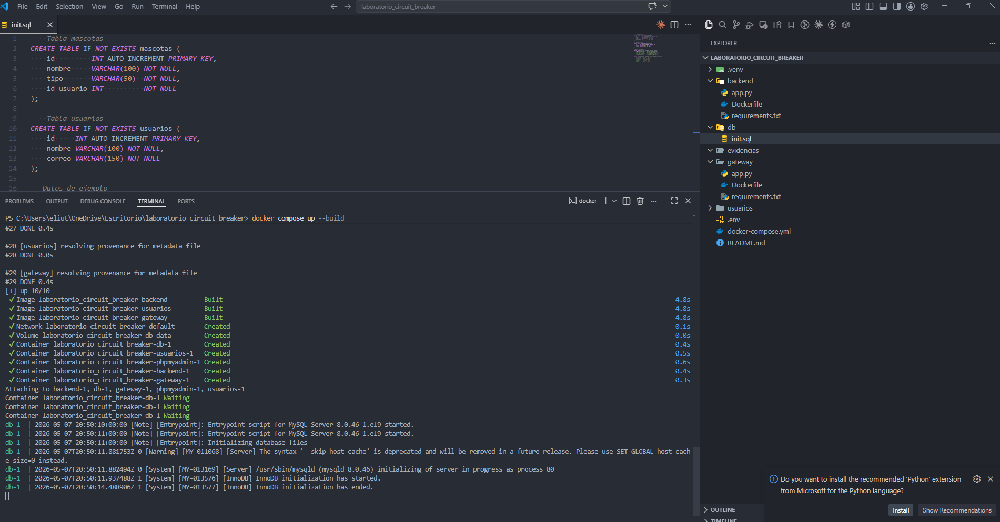
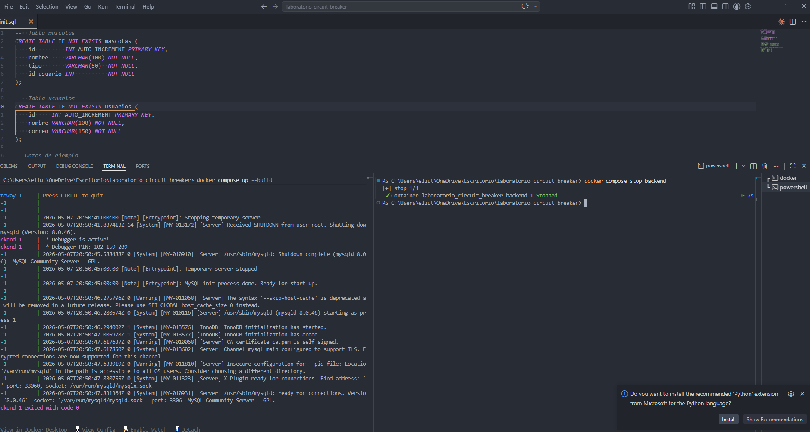
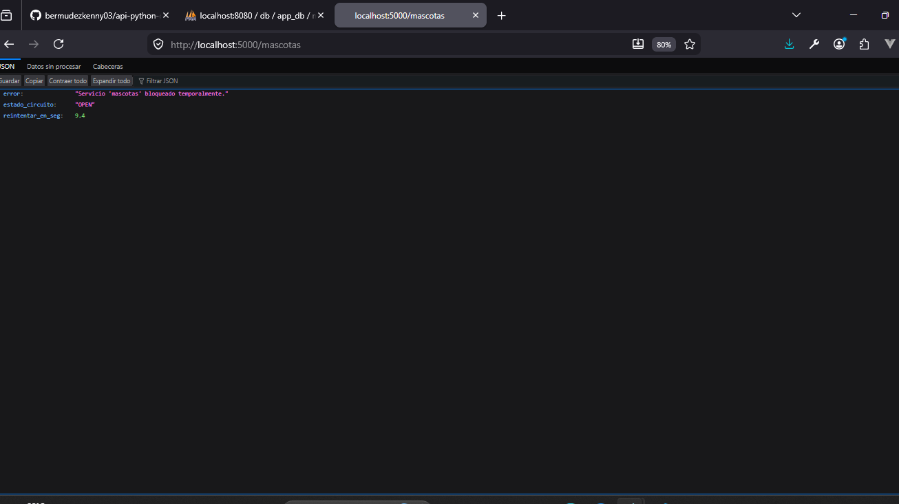
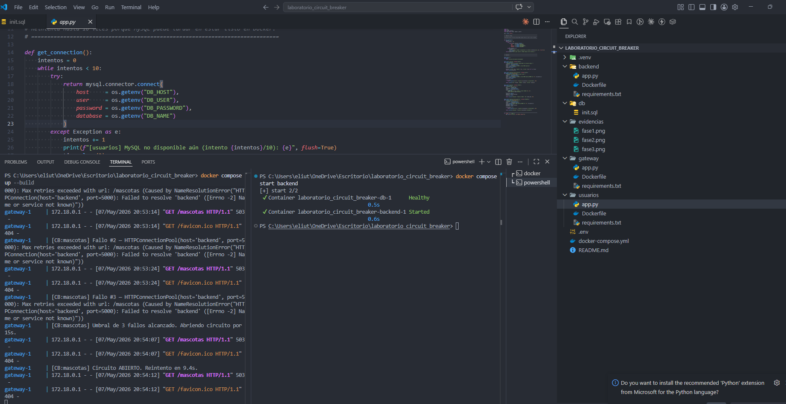
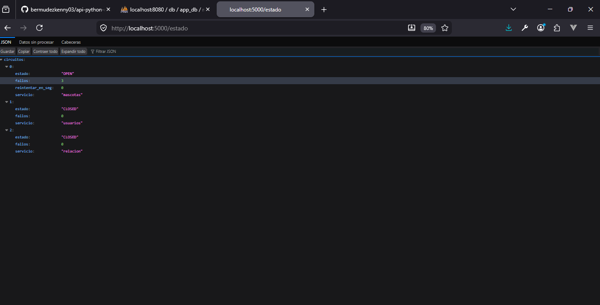

# Laboratorio - Circuit Breaker

Implementación de un patrón **Circuit Breaker** usando microservicios con Flask y Docker Compose.

El objetivo del laboratorio es analizar el comportamiento de un sistema distribuido ante fallos de servicios y aplicar mecanismos de resiliencia mediante estados `CLOSED`, `OPEN` y `HALF_OPEN`.

---

# Integrantes

- Nombre Apellido
- Nombre Apellido
- Nombre Apellido

---

# Tecnologías utilizadas

- Python
- Flask
- Docker
- Docker Compose
- Requests
- Variables de entorno (`.env`)

---

# Estructura del repositorio

```text
laboratorio_circuit_breaker/
├── docker-compose.yml
├── .env
├── README.md
├── gateway/
│   ├── app.py
│   ├── Dockerfile
│   └── requirements.txt
├── usuarios/
│   ├── app.py
│   ├── Dockerfile
│   └── requirements.txt
├── backend/
│   ├── app.py
│   ├── Dockerfile
│   └── requirements.txt
└── evidencias/
    ├── fase1.png
    ├── fase2.png
    ├── fase3.png
    ├── fase4.png
    └── fase5.png
```

---

# Cómo ejecutar el proyecto

## 1. Clonar el repositorio

```bash
git clone URL_DEL_REPOSITORIO
```

---

## 2. Entrar a la carpeta

```bash
cd laboratorio_circuit_breaker
```

---

## 3. Levantar los servicios

```bash
docker compose up --build
```

---

# Endpoints disponibles

| Endpoint | URL | Descripción |
|---|---|---|
| `/mascotas` | http://localhost:5000/mascotas | Lista mascotas |
| `/usuarios` | http://localhost:5000/usuarios | Lista usuarios |
| `/resumen` | http://localhost:5000/resumen | Respuesta combinada |
| `/relacion` | http://localhost:5000/relacion | Relación mascota-usuario |
| `/estado` | http://localhost:5000/estado | Estado de los circuitos |

---

# Configuración del Circuit Breaker

Los parámetros del sistema se configuran desde el archivo `.env`.

```env
# Número de fallos consecutivos para abrir el circuito
CB_UMBRAL_FALLOS=3

# Tiempo de espera antes de intentar recuperación
CB_TIEMPO_ESPERA=15

# Timeout HTTP por petición
CB_TIMEOUT_HTTP=2
```

---

# Funcionamiento del Circuit Breaker

El sistema implementa los tres estados clásicos del patrón Circuit Breaker:

| Estado | Descripción |
|---|---|
| `CLOSED` | El servicio funciona normalmente |
| `OPEN` | El circuito bloquea llamadas al servicio |
| `HALF_OPEN` | Se realiza una petición de prueba |

---

# Flujo del circuito

```text
CLOSED ──(3 fallos)──► OPEN
OPEN ──(15 segundos)──► HALF_OPEN
HALF_OPEN ──(éxito)──► CLOSED
HALF_OPEN ──(fallo)──► OPEN
```

---

# FASE 1 – OBSERVAR

## Objetivo

Analizar el comportamiento del sistema original al apagar un servicio.

---

## Procedimiento

Apagar el backend:

```bash
docker compose stop backend
```

Consultar:

```bash
http://localhost:5000/mascotas
```

Ver logs:

```bash
docker compose logs gateway
```

---

## Resultado observado

| Endpoint | Comportamiento |
|---|---|
| `/mascotas` | Bloquea después de varios fallos |
| `/usuarios` | No tenía protección |

---

## Evidencia



---

# FASE 2 – APLICAR

## Objetivo

Extender el patrón Circuit Breaker a múltiples servicios usando una clase reutilizable.

---

## Implementación

```python
cb_mascotas = CircuitBreaker("mascotas", CB_UMBRAL_FALLOS, CB_TIEMPO_ESPERA)

cb_usuarios = CircuitBreaker("usuarios", CB_UMBRAL_FALLOS, CB_TIEMPO_ESPERA)

cb_relacion = CircuitBreaker("relacion", CB_UMBRAL_FALLOS, CB_TIEMPO_ESPERA)
```

---

## Decisiones tomadas

- Un circuito independiente por servicio.
- Parámetros configurables desde `.env`.
- Clase reutilizable en lugar de variables globales.

---

## Evidencia



---

# FASE 3 – INVESTIGAR

## Objetivo

Comprender el funcionamiento del estado `HALF_OPEN`.

---

## Explicación

El estado `HALF_OPEN` permite realizar una única petición de prueba después de un tiempo de espera.

Si la petición funciona:

```text
HALF_OPEN → CLOSED
```

Si falla:

```text
HALF_OPEN → OPEN
```

---

## Evidencia



---

# FASE 4 – IMPLEMENTAR

## Objetivo

Implementar recuperación automática del circuito.

---

## Código principal

```python
if self.estado == self.OPEN:
    if time.time() - self.tiempo_apertura >= self.tiempo_espera:
        self.estado = self.HALF_OPEN
```

---

## Parámetros usados

| Variable | Valor |
|---|---|
| `CB_UMBRAL_FALLOS` | 3 |
| `CB_TIEMPO_ESPERA` | 15 segundos |
| `CB_TIMEOUT_HTTP` | 2 segundos |

---

## Evidencia



---

# FASE 5 – VALIDAR

## Objetivo

Comprobar el funcionamiento completo del Circuit Breaker.

---

## Escenarios probados

### Servicio funcionando

```json
{
  "estado": "CLOSED"
}
```

---

### Servicio caído

```json
{
  "estado": "OPEN"
}
```

---

### Recuperación automática

```json
{
  "estado": "HALF_OPEN"
}
```

---

## Evidencia



---

# Comandos útiles

## Detener backend

```bash
docker compose stop backend
```

---

## Iniciar backend

```bash
docker compose start backend
```

---

## Ver logs

```bash
docker compose logs -f gateway
```

---

# Análisis final

## Mejoras obtenidas

- Recuperación automática.
- Independencia entre servicios.
- Configuración externa mediante `.env`.
- Respuestas rápidas ante fallos.
- Monitoreo mediante `/estado`.

---

## Dificultades encontradas

- Manejo del estado en memoria.
- Ajuste de tiempos de espera.
- Validación de recuperación real del servicio.

---

# Conclusión

La implementación del patrón Circuit Breaker permitió mejorar la resiliencia del sistema distribuido evitando saturación de servicios caídos y permitiendo recuperación automática sin reiniciar el gateway.

El laboratorio demuestra cómo aplicar tolerancia a fallos en arquitecturas basadas en microservicios utilizando Flask y Docker.

---

# Autor

Proyecto académico desarrollado para el laboratorio de resiliencia y tolerancia a fallos con microservicios.